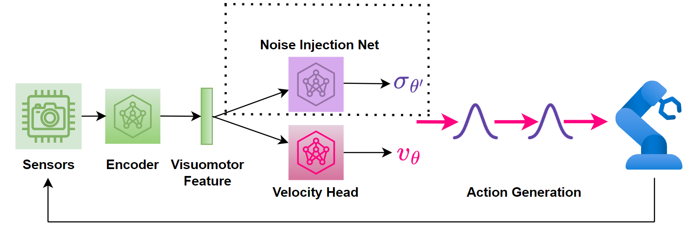

# ReinFlow: Fine-tuning Flow Matching Policy with Online Reinforcement Learning

<!-- schematic: -->

  

<!-- links: -->

  
  
  

<!-- mini table of contents: -->

  <a href="#rocket-installation">Installation</a> |
  <a href="#rocket-quick-start-reproduce-our-results">Quick Start</a> |
  <a href="#rocket-implementation-details">Implementation Details</a> |
  <a href="#rocket-adding-your-own-dataset-or-environment">Add Dataset/Environment</a>  
  <a href="#rocket-debug-aid-and-known-issues">Debug & Known Issues</a> |
  <a href="#license">License</a> |
  <a href="#acknowledgement">Acknowledgement</a>

## :star: Comming Soon
- Add Theory and Algorithms to the webpage with drop-down bars. 
- Possible open-source the WandB projects via a corporate account.   (currently is in .csv format)
- Open-source training data to Hugging Face via a corporate account. (currently is with google drive)
- Support fine-tuning [Mean Flow](https://arxiv.org/abs/2505.13447) with online RL
- Replace figs with videos in the drop-down menu of specific tasks in the webpage.

## :rocket:  Installation
Please follow the steps in [installation/reinflow-setup.md](./installation/reinflow-setup.md).

## :rocket: Quick Start: Reproduce Our Results
To fully reproduce our experiments, please refer to [ReproduceExps.md](docs/ReproduceExps.md). 
To download our training data and reproduce the plots in the paper, please refer to [ReproduceFigs.md](docs/ReproduceFigs.md).

## :rocket: Implementation Details
Please refer to [Implement.md](docs/Implement.md) for descriptions of key hyperparameters of FQL, DPPO, and ReinFlow.

## :rocket: Adding Your Own Dataset or Environment
Please refer to [Custom.md](docs/Custom.md).

## :rocket: Debug Aid and Known Issues
Please refer to [KnownIssues.md](docs/KnownIssues.md) to see how to resolve errors you encounter.

## License
This repository is released under the MIT license. See [LICENSE](LICENSE).

## Acknowledgement
This repository was developed from multiple open-source projects. Major references include:  
- [TorchCFM, Tong et al.](https://github.com/atong01/conditional-flow-matching): Conditional flow-matching repository.  
- [Shortcut Models, Francs et al.](https://github.com/kvfrans/shortcut-models): One-step Diffusion via Shortcut Models. 
- [DPPO, Ren et al.](https://github.com/irom-princeton/dppo): DPPO official implementation.  

For more references, please refer to [Acknowledgement.md](docs/Acknowledgement.md).
